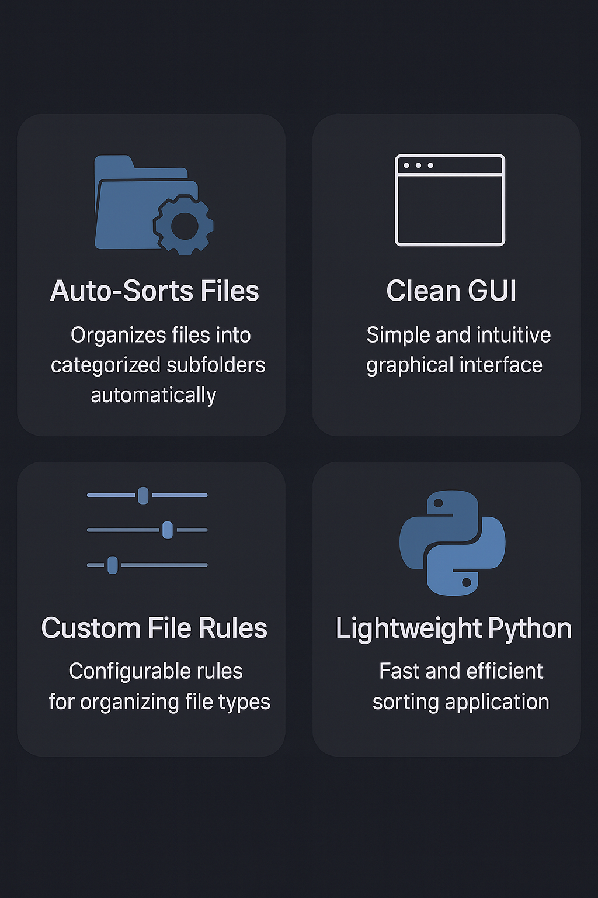
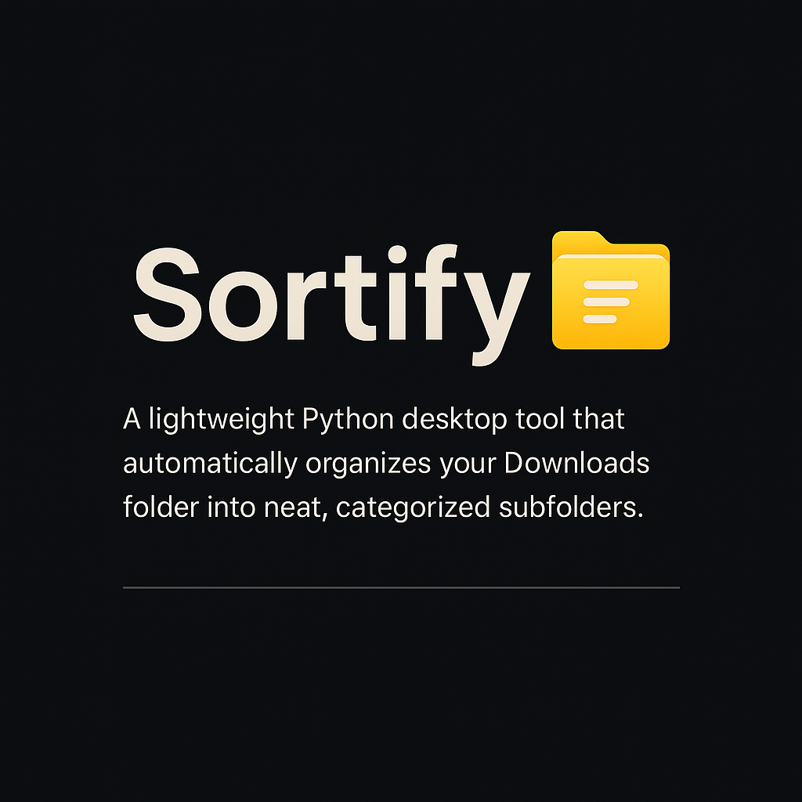

<p align="center">
  
</p>

<hr>

<p align="center">
  
</p>

<h1 style="font-size:28px; font-weight:600;">📁 Sortify — Automatic Downloads Folder Organizer</h1>

Sortify is a lightweight Python desktop tool that automatically organizes your cluttered **Downloads** folder into neat, categorized subfolders — all with a clean and intuitive GUI.

<hr>

<p align="center">
  
</p>

<h2 style="font-size:22px; font-weight:600;">🌟 Features</h2>

<p align="center">
  
</p>

<hr>

<p align="center">
  
</p>

<h2 style="font-size:22px; font-weight:600;">🖥️ Application Screens</h2>

<h3 style="font-size:18px; font-weight:600;">1️⃣ Choose Folder</h3>
<p align="center">
  
</p>

<hr>

<p align="center">
  
</p>

<h3 style="font-size:18px; font-weight:600;">2️⃣ Sorting in Progress</h3>
<p align="center">
  
</p>

<hr>

<p align="center">
  
</p>

<h3 style="font-size:18px; font-weight:600;">3️⃣ Sorting Complete</h3>
<p align="center">
  
</p>

<hr>

<p align="center">
  
</p>

<h2 style="font-size:22px; font-weight:600;">⚙️ How It Works</h2>

Sortify scans your chosen folder and automatically moves files into categorized subfolders based on extension mappings defined inside `config.py`.

### Default Categories:
- **Images:** `.png`, `.jpg`, `.jpeg`, `.gif`  
- **Documents:** `.pdf`, `.docx`, `.pptx`, `.txt`  
- **Archives:** `.zip`, `.rar`, `.7z`  
- **Media:** `.mp3`, `.mp4`, `.wav`  
- **Others:** Any unmatched extensions  

You can customize all categories to fit your workflow.

<hr>

<p align="center">
  
</p>

<h2 style="font-size:22px; font-weight:600;">🚀 Getting Started</h2>

### 1. Clone the Repository
```bash
git clone https://github.com/Mallesh-145/Sortify.git
cd Sortify
```

### 2. Install Dependencies (if required)
```bash
pip install -r requirements.txt
```

### 3. Run the Application
```bash
python gui.py
```

The Sortify GUI will launch — select your folder and click **Sort** to clean everything instantly.

<hr>

<p align="center">
  
</p>

<h2 style="font-size:22px; font-weight:600;">🧩 Project Structure</h2>

```
Sortify/
│
├── base.py               # Core helper utilities
├── config.py             # File-type rules and category mapping
├── Organiser.py          # Main sorting engine
├── gui.py                # Tkinter-based GUI
└── assets/               # Images used in README
```

<hr>

<p align="center">
  
</p>

<h2 style="font-size:22px; font-weight:600;">✨ Dark Mode Banner</h2>

<p align="center">
  
</p>

<hr>

<p align="center">
  
</p>

<h2 style="font-size:22px; font-weight:600;">🔮 Future Enhancements</h2>

- Drag-and-drop folder selection  
- Progress bar with real-time updates  
- Undo / restore previous sort  
- Scheduled auto-sort (hourly/daily)  
- Light/Dark theme switcher  
- Advanced rule editor for custom file mappings  

<hr>

<p align="center">
  
</p>

<h2 style="font-size:22px; font-weight:600;">👤 Developer</h2>

Mallesh  
Building automation tools, clean UIs, and useful desktop utilities in Python.

If you like this project, consider giving it a ⭐ on GitHub!

<p align="center">
  
</p>
