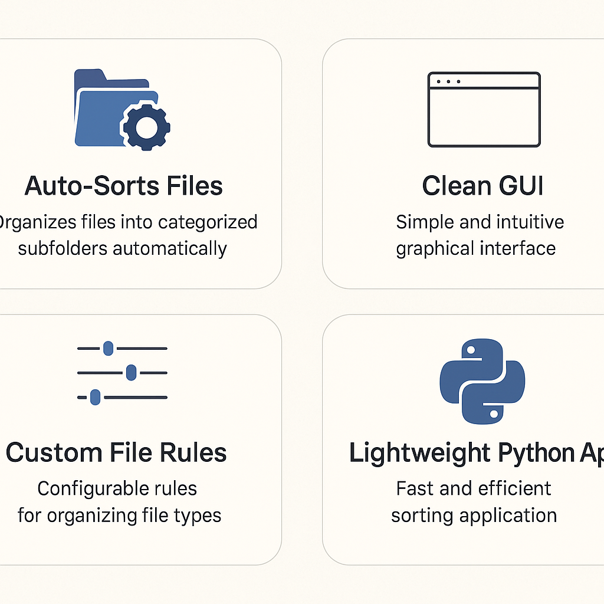

---


# 📁 Sortify — Automatic Downloads Folder Organizer

Sortify is a lightweight Python desktop utility that instantly organizes your cluttered **Downloads** folder into clean, categorized subfolders — with a simple, intuitive GUI.

---


## 🌟 Features



---


## 🖥️ Application Screens

### **1️⃣ Choose Folder**


---


### **2️⃣ Sorting in Progress**


---


### **3️⃣ Sorting Complete**


---


## ⚙️ How It Works

Sortify reads all files inside your chosen folder and moves them into organized subdirectories based on file extension categories you define in the config file.

### Default Categories:
- Images → `.png`, `.jpg`, `.jpeg`, `.gif`  
- Documents → `.pdf`, `.docx`, `.pptx`, `.txt`  
- Archives → `.zip`, `.rar`, `.7z`  
- Media → `.mp3`, `.mp4`, `.wav`  
- Others → Unmatched file extensions  

You can edit all categories in `config.py`.

---


## 🚀 Getting Started

### **1. Clone the Repository**
```bash
git clone https://github.com/Mallesh-145/Sortify.git
cd Sortify
```

### **2. Install Dependencies (if any)**
```bash
pip install -r requirements.txt
```

### **3. Run the App**
```bash
python gui.py
```

Sortify will open with a clean GUI where you can choose your folder and start sorting instantly.

---


## 🧩 Project Structure

```
Sortify/
│
├── base.py            # Core helper logic
├── config.py          # File category rules & settings
├── Organiser.py       # Main sorting engine
├── gui.py             # Tkinter UI
└── assets/            # Images used in README
```

---


## ✨ Dark Mode Banner (Bonus)


---


## 🔮 Future Enhancements

- Drag-and-drop folder selection  
- Progress percentage indicator  
- Undo/restore previous sort  
- Scheduling (auto-sort every hour/day)  
- Theme selector (light/dark UI)  
- More advanced category mapping UI  

---


## 👤 Developer

**Mallesh (Echo)**  
A developer exploring automation, Python GUI tools, and clean UI-driven workflows.

If you like this project, ⭐ star the repo!

---


